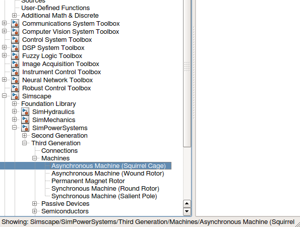
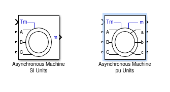

###交流异步电动机转速

>理想转速=频率*60/极对数

>实际转速= 理想转速*（1-转差率）

转差是指交流电机中**转子转速**与**定子旋转磁场转速**之差

当频率和电压一定时，转差与负载有关

###相电流

三相电源中流过每相负载的电流为相电流，用Iab、Ibc、Iac表示。

对于星型接法的电动机，相电流等于线电流。
对于三角型接法的电动机，线电流等于相电流的√3倍。

###线电流

三相电源中每根导线中的电流为线电流，用IA、IB、IC表示

simulink中的电机模型

1. 异步电机(鼠笼,绕线转子)
2. 永磁电机
3. 同步电机(圆形转子,凸极)

SI:国际单位制
pu:标幺制(标么)

红线是由于你所用的方块之间的类型不匹配导致的，如图在最左边的“AC Voltage Source”端口是方块的表示该端口是电气属性，而如下方的“Pulse Generator”端口是一个尖号，表示该端口只是数字属性，电气属性的和数字属性的方块间不能直接相连，在SIMULINK中就表现是红线，解决方法就是数字的只能跟数字的方块相连，用来做一些控制类的运算或信号检测，而电气的也只能跟电气的搜索方块相连，进行电路特性的仿真。