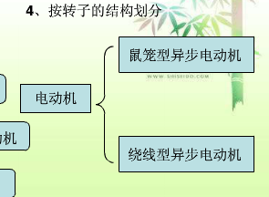
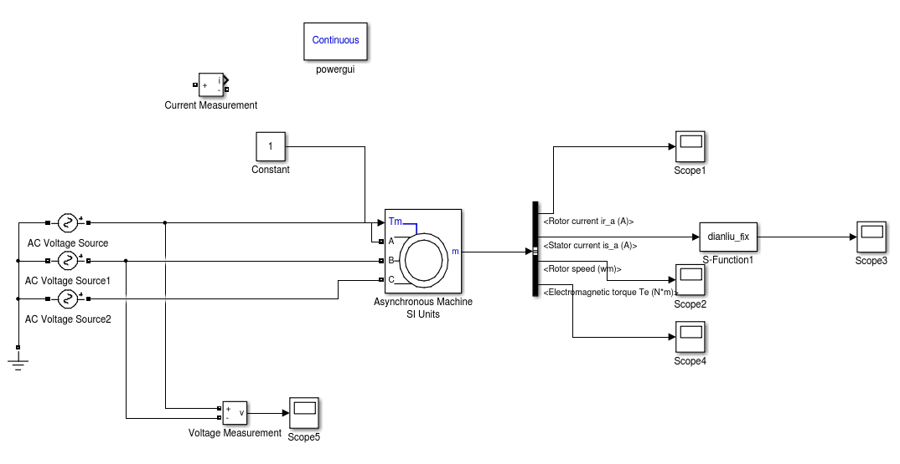

##电机分类




##直流电机

将直流电能转换为机械能的转动装置。电动机定子提供磁场，直流电源向转子的绕组提供电流，换向器使转子电流与磁场产生的转矩保持方向不变。

* 定子包括：主磁极，机座，换向极(安装在相邻的两主磁极之间,换向极能减小电机运行时电刷与换向器之间可能产生的换向火花)，电刷(静止,与换向器连接)装置等。
* 转子包括：电枢铁芯，电枢绕组，换向器(commutator 俗称整流子,改变电流方向)，轴和风扇等


通常直流电动机的励磁方式有4种：直流他励电动机、直流并励电动机、直流串励电动机和直流复励电动机。

1. 串励直流电动机:励磁绕组(可以产生磁场的线圈绕组)与转子绕组之间通过电刷和换向器相串联，励磁电流与电枢电流成正比，定子的磁通量随着励磁电流的增大而增大，转矩近似与电枢电流的平方成正比，转速随转矩或电流的增加而迅速下降。其起动转矩可达额定转矩的5倍以上，短时间过载转矩可达额定转矩的4倍以上，转速变化率较大，空载转速甚高（一般不允许其在空载下运行）。可通过用外用电阻器与串励绕组串联（或并联）、或将串励绕组并联换接来实现调速。
2. 并励直流电动机:励磁绕组与转子绕组相并联，其励磁电流较恒定，起动转矩与电枢电流成正比，起动电流约为额定电流的2.5倍左右。转速则随电流及转矩的增大而略有下降，短时过载转矩为额定转矩的1.5倍。转速变化率较小，为5%~15%。可通过消弱磁场的恒功率来调速。
3. 他励直流电动机:励磁绕组接到独立的励磁电源供电，其励磁电流也较恒定，起动转矩与电枢电流成正比。转速变化也为5%~15%。可以通过消弱磁场恒功率来提高转速或通过降低转子绕组的电压来使转速降低。
4. 复励直流电动机:定子磁极上除有并励绕组外，还装有与转子绕组串联的串励绕组（其匝数较少）。串联绕组产生磁通的方向与主绕组的磁通方向相同，起动转矩约为额定转矩的4倍左右，短时间过载转矩为额定转矩的3.5倍左右。转速变化率为25%~30%（与串联绕组有关）。转速可通过消弱磁场强度来调整。

###有刷直流电机

####电磁直流电机

电磁式直流电动机的定子磁极（主磁极）由铁心和励磁绕组构成。

####永磁直流电机

指使用了永磁体的电机，这类电机不需要励磁

###无刷直流电机

无刷电机是指无电刷和换向器（或集电环）的电机，又称无换向器电机。传统型直流电动机电枢是旋转的，磁极是静止的，但无刷直流电动机于此相反，磁极是旋转的，电枢是静止的，电枢绕组的电流换向可借助位置传感器和电子开关电路来完成。使电机无刷。

**组成**:无刷直流电动机一般由电动机、位置传感器、和电子开关三部分组成。

**原理**:依靠改变输入到无刷电机定子线圈上的电流波交变频率和波形，在绕组线圈周围形成一个绕电机几何轴心旋转的磁场，这个磁场驱动转子上的永磁磁钢转动，电机就转起来了，电机的性能和磁钢数量、磁钢磁通强度、电机输入电压大小等因素有关，更与无刷电机的控制性能有很大关系，因为输入的是直流电，电流需要电子调速器将其变成3相交流电，还需要从遥控器接收机那里接收控制信号，控制电机的转速，以满足模型使用需要。 总的来说，无刷电机的结构是比较简单的，真正决定其使用性能的还是无刷电子调速器，好的电子调速器需要有单片机控制程序设计、电路设计、复杂加工工艺等过程的总体控制，所以价格要比无刷电机高出很多。

**调速**:直流无刷电机的换向电路由驱动及控制两部分组成

电机转子的转速受电机定子旋转磁场的速度及转子极数(p)影响：
n=60．f / p。在转子极数固定情况下，改变定子旋转磁场的频率就可以改变转子的转速。直流无刷电机即是将同步电机加上电子式控制(驱动器)，控制定子旋转磁场的频率并将电机转子的转速回授至控制中心反复校正，以期达到接近直流电机特性的方式。也就是说直流无刷电机能够在额定负载范围内当负载变化时仍可以控制电机转子维持一定的转速。

**自控式逆变器**:无刷直流电动机中采用的是自控式逆变器。它与一般的逆变器不同。它的输出频率不是独立调节的，而是受安装在同步电动机轴上的转子位置检测器控制。每当转子转过一定位置(例如90°或120°电角度),位置检测器便产生相应的信号，作用于对应的半导体元件，使相应的相绕组通电，产生转矩。电动机转子每转过一对磁极，各半导体元件轮流导通一周，逆变器输出的交流电相应地变化一个周期。所以自控式逆变器的输出频率和电动机的转速始终保持同步，不会出现失步现象。

在小型无刷直流电动机中，逆变器由晶体管组成。由于晶体管具有自关断能力，只要其基极上的控制信号消失，晶体管就自行关断，所以控制比较简单。在容量较大的无刷直流电机中，逆变器由晶闸管组成。晶闸管没有自关断能力，不能靠除去触发信号使其关断。所以当一相电流需要截止，让另一相通电时，如何关断原先导通的晶闸管，把电流转移到新的一相晶闸管，即晶闸管之间的换流问题是晶闸管电机的技术关键。

**位置检测器**:装在电动机轴上的转子位置检测器是无刷直流电机的重要部件。它决定着电枢各相绕组开始通电的时刻。它的作用相当于一般直流电机中的电刷。改变位置检测器产生信号的时刻（相位），相当于直流电机中改变电刷在空间的位置，对无刷直流电机的特性有很大的影响。位置检测器的结构型式很多，它通常包括一组静止的探测元件和一个随电机转子一起转动的位置信号形成器。在由霍耳元件构成的位置检测器中，霍耳元件就是探测元件，而电机转子磁极本身就是位置信号形成器。在其他的结构中，如电磁感应式、光电式、按近开关式中，常利用一个带缺口的圆盘作为位置信号形成器。例如，在光电式中利用这个缺口使光线照射到光电管上产生信号；在电磁感应式中用这个缺口改变开口变压器的磁路，使检测线圈中产生电动势等等


The power_brushlessDCmotorpower_brushlessDCmotor example illustrates the use of the Permanent Magnet Synchronous Machine block in motoring mode with a closed-loop control system built entirely with Simulink blocks. The complete system includes a six step inverter block from the SimPowerSystems™ library. Two control loops are used; the inner loop synchronizes the pulses of the bridge with the electromotive forces, and the outer loop regulates the motor's speed, by varying the DC bus voltage. The mechanical torque applied at the motor's shaft is originally 0 N.m (no load) and steps to its nominal value (3 N.m) at t = 0.1 second. The parameters of the machine are found in the dialog box.


缺点:运行时间特别长

###simulink中的电机模型


1. 异步电机(鼠笼,绕线转子)
2. 永磁电机(PM)
3. 同步电机(圆形转子,凸极)


第一个没有三相输出是鼠笼电机,有三相输出是绕线式电机

SI:国际单位制
pu:标幺制(标么)

###搭建交流异步电机




输入参数:

1. Tm:一般接负载,轴上的机械转矩
2. A,B,C:定子电压输入,一般直接接三相交流电源(星形和三角形解法)

输出参数:(21路信号)

其中m:

1. Rator current ir_a(b,c) 转子电流
2. d-q坐标下转子信号:
	* Rotor current id:d轴电流
	* Rotor current iq:q轴电流
	* Rotor flux phir_q:q轴磁通
	* Rotor flux phir_dd轴磁通
	* Rotor voltage Vr_q:q轴电流
	* Rotor voltage Vr_d:d轴磁通
3. Lm(H):?
4. Rotor speed(wm):电机转速
5. Electromagnetic torque Te():机械转矩
6. Rotor angle thetam(rad):电机转子角位移

如果非鼠笼电机会有三个电压输出,一般短接在一起,或连接到其他附加的电路中.

###连接温升-电流模块


原因:

1. 三相电动机启动时的瞬时启动电流是电机额定电流的5-7倍，如果电机质量不好，甚至有到10倍的.
2. 温升-电流模块是依据瞬时电流建立的(bug),不保留以前的参数,非积分.

解决办法;

1. 在电机启动阶段,忽略掉电流瞬时变化,待电流稳定时再计算温升
2. 重写温升-电流模块,改为积分算法(还未实现)
3. 用另外一种电机温升公式,粗略估计电机的温升


###电机绕组温升公式


```
绕组温升公式： 

△t=(R2-R1)/R1*(234.5+t1)-(t2-t1)

▽t---绕组温升 
R1---实验开始的电阻   (冷态电阻)
R2---实验结束时的电阻 (热态电阻)
k---对铜绕组，等于234.5；对于铝绕组：225 
t1---实验开始时的室温
t2---实验结束时的室温
 
电机温升公式:

θ=(R2-R1)/R1*(235+t1)+t1-t2(K)

R2-试验结束时的绕组电阻，Ω；
R1-试验初始时的绕组电阻，Ω；
t1-试验初始时的绕组温度（一般指室温），℃；
t2-试验结束时的冷却介质温度（一般指室温），℃。
235是铜线，铝线为225
 
电阻发温升计算公式：

Q=（Rr-Re)/Re x (235+te)+te-tk 

Rr:发热状态下的绕组电阻。
Re:冷却状态下的绕组电阻。
te:测量Re时的环境温度，也就是实验开始时的绕组温度。
tk:做温升实验结束时的环境温度。

```


###交流异步电动机转速

>理想转速=频率*60/极对数

>实际转速= 理想转速*（1-转差率）

转差是指交流电机中**转子转速**与**定子旋转磁场转速**之差

当频率和电压一定时，转差与负载有关

**相电流**

三相电源中流过每相负载的电流为相电流，用Iab、Ibc、Iac表示。

对于星型接法的电动机，相电流等于线电流。
对于三角型接法的电动机，线电流等于相电流的√3倍。

**线电流**

三相电源中每根导线中的电流为线电流，用IA、IB、IC表示

**同步电机**:稳态运行时，转子的转速和电网频率之间有不变的关系