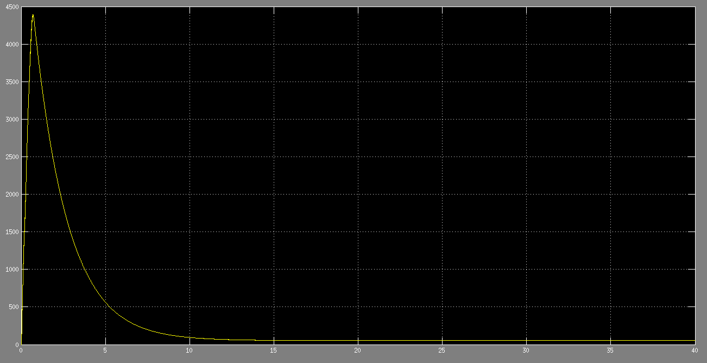

###simulink中的电机模型


1. 异步电机(鼠笼,绕线转子)
2. 永磁电机(PM)
3. 同步电机(圆形转子,凸极)


第一个没有三相输出是鼠笼电机,有三相输出是绕线式电机

SI:国际单位制
pu:标幺制(标么)

###搭建交流异步电机


输入参数:

1. Tm:一般接负载,轴上的机械转矩
2. A,B,C:定子电压输入,一般直接接三相交流电源(星形和三角形解法)

输出参数:(21路信号)

其中m:

1. Rator current ir_a(b,c) 转子电流
2. d-q坐标下转子信号:
	* Rotor current id:d轴电流
	* Rotor current iq:q轴电流
	* Rotor flux phir_q:q轴磁通
	* Rotor flux phir_dd轴磁通
	* Rotor voltage Vr_q:q轴电流
	* Rotor voltage Vr_d:d轴磁通
3. Lm(H):?
4. Rotor speed(wm):电机转速
5. Electromagnetic torque Te():机械转矩
6. Rotor angle thetam(rad):电机转子角位移

如果非鼠笼电机会有三个电压输出,一般短接在一起,或连接到其他附加的电路中.

###连接温升-电流模块



原因:

1. 三相电动机启动时的瞬时启动电流是电机额定电流的5-7倍，如果电机质量不好，甚至有到10倍的.
2. 温升-电流模块是依据瞬时电流建立的(bug),不保留以前的参数,非积分.

解决办法;

1. 在电机启动阶段,忽略掉电流瞬时变化,待电流稳定时再计算温升
2. 重写温升-电流模块,改为积分算法(还未实现)
3. 用另外一种电机温升公式,粗略估计电机的温升


###电机绕组温升公式


```
绕组温升公式： 

△t=(R2-R1)/R1*(234.5+t1)-(t2-t1)

▽t---绕组温升 
R1---实验开始的电阻   (冷态电阻)
R2---实验结束时的电阻 (热态电阻)
k---对铜绕组，等于234.5；对于铝绕组：225 
t1---实验开始时的室温
t2---实验结束时的室温
 
电机温升公式:

θ=(R2-R1)/R1*(235+t1)+t1-t2(K)

R2-试验结束时的绕组电阻，Ω；
R1-试验初始时的绕组电阻，Ω；
t1-试验初始时的绕组温度（一般指室温），℃；
t2-试验结束时的冷却介质温度（一般指室温），℃。
235是铜线，铝线为225
 
电阻发温升计算公式：

Q=（Rr-Re)/Re x (235+te)+te-tk 

Rr:发热状态下的绕组电阻。
Re:冷却状态下的绕组电阻。
te:测量Re时的环境温度，也就是实验开始时的绕组温度。
tk:做温升实验结束时的环境温度。

```


##无刷直流电机

####结构

直流无刷电机是同步电机的一种，也就是说电机转子的转速受电机定子旋转磁场的速度及转子极数(p)影响：

n=60．f / p

在转子极数固定情况下，改变定子旋转磁场的频率就可以改变转子的转速。直流无刷电机即是将同步电机加上电子式控制(驱动器)，控制定子旋转磁场的频率并将电机转子的转速回授至控制中心反复校正，以期达到接近直流电机特性的方式。也就是说直流无刷电机能够在额定负载范围内当负载变化时仍可以控制电机转子维持一定的转速。

直流无刷驱动器包括电源部及控制部如图 (1) ：电源部提供三相电源给电机，控制部则依需求转换输入电源频率。

电源部可以直接以直流电输入(一般为24v)或以交流电输入(110v/220 v)，如果输入是交流电就得先经转换器(converter)转成直流。不论是直流电输入或交流电输入要转入电机线圈前须先将直流电压由换流器(inverter)转成3相电压来驱动电机。换流器(inverter)一般由6个功率晶体管(q1～q6)分为上臂(q1、q3、q5)/下臂(q2、q4、q6)连接电机作为控制流经电机线圈的开关。控制部则提供pwm(脉冲宽度调制)决定功率晶体管开关频度及换流器(inverter)换相的时机。直流无刷电机一般希望使用在当负载变动时速度可以稳定于设定值而不会变动太大的速度控制，所以电机内部装有能感应磁场的霍尔传感器(hall-sensor)，做为速度之闭回路控制，同时也做为相序控制的依据。但这只是用来做为速度控制并不能拿来做为定位控制。

###交流异步电动机转速

>理想转速=频率*60/极对数

>实际转速= 理想转速*（1-转差率）

转差是指交流电机中**转子转速**与**定子旋转磁场转速**之差

当频率和电压一定时，转差与负载有关

###相电流

三相电源中流过每相负载的电流为相电流，用Iab、Ibc、Iac表示。

对于星型接法的电动机，相电流等于线电流。
对于三角型接法的电动机，线电流等于相电流的√3倍。

###线电流

三相电源中每根导线中的电流为线电流，用IA、IB、IC表示

###电网自愈

状态检测为前提

###疑问

1. 自愈系统的状态检测(何时进行自愈)
2. 自愈算法(状态如何调整,如果调整转速对生产会产生影响)
3. 自愈算法的可行性?