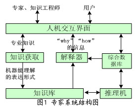
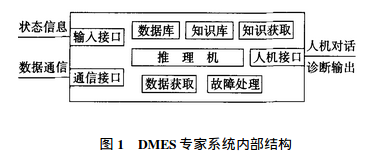
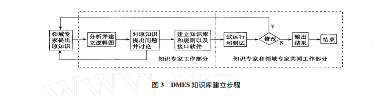
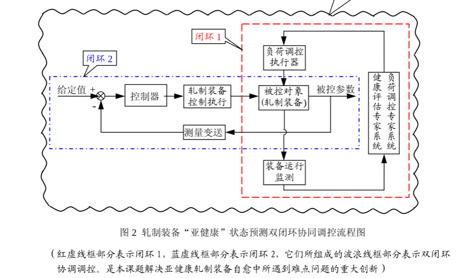

##直流电机故障诊断专家系统

专家系统（Expert System)是一种在特定领域内具有专家水平解决问题能力的程序系统。它能够有效地运用专家多年积累的有效经验和专门知识，通过模拟专家的思维过程，解决需要专家才能解决的问题。

专家系统属于人工智能的一个发展分支，自1968年费根鲍姆等人研制成功第一个专家系统DENDEL以来，专家系统获得了飞速的发展，并且运用于医疗、军事、地质勘探、教学、化工等领域，产生了巨大的经济效益和社会效益。现在，专家系统已成为人工智能领域中最活跃、最受重视的领域。

####专家系统(ES)的构造

专家系统通常由人机交互界面、知识库、推理机、解释器、综合数据库、知识获取等6个部分构成。

####专家系统(ES)的特点

(1)为解决特定领域的具体问题，除需要一些公共的常识，还需要大量与所研究领域问题密切相关的知识；

(2)一般采用启发式的解题方法(“自我发现的能力”或“运用某种方式或方法去判定事物的知识和技能”)；

(3)在解题过程中除了用演绎方法外，有时还要求助于归纳方法和抽象方法；

(4)需处理问题的模糊性、不确定性和不完全性；

(5)能对自身的工作过程进行推理(自推理或解释)；

(6)采用基于知识的问题求解方法；

(7)知识库与推理机分离。

####专家系统(ES)的分类
用于某一特定领域内的专家系统，可以划分为以下几类：

1. **诊断型专家系统**：根据对症状的观察分析，推导出产生症状的原因以及排除故障方法的一类系统，如医疗、机械、经济等。
2. 解释型专家系统：根据表层信息解释深层结构或内部情况的一类系统，如地质结构分析、物质化学结构分析等。
3. 预测型专家系统：根据现状预测未来情况的一类系统，如气象预报、人口预测、水文预报、经济形势预测等。
4. 设计型专家系统：根据给定的产品要求设计产品的一类系统，如建筑设计、机械产品设计等。
5. 决策型专家系统：对可行方案进行综合评判并优选的一类专家系统。
6. 规划型专家系统：用于制定行动规划的一类专家系统，如自动程序设计、军事计划的制定等。
7. 教学型专家系统：能够辅助教学的一类专家系统。
8. 数学专家系统：用于自动求解某些数学问题的一类专家系统。
9. 监视型专家系统：对某类行为进行监测并在必要时候进行干预的一类专家系统，如机场监视、森林监视等。

##直流电机故障诊断专家系统(DMES)

直流电机由于运行条件恶劣,因此出现故障类型较多,运行中容易出现各种形式的换向故障、机械故障、绝缘故障和电气故障。它们产生的原因错综复杂,在运行中要及时发现和诊断这些故障是一项难度较高的工作.

1995年冶金自动化研究设计院开始开发直流电机故障诊断专家系统,并于1997年在宝钢热轧厂5000kW轧钢电机上实际使用。这个名为DMES(直流电机故障诊断专家系统)专家系统是利用数据采集装置获取电机运行时的各种状态信息,通过用户界面的人机接口进行人机对话,实现交互式诊断。研制DMES专家系统的目的是通过监测和诊断早期发现故障征兆,以减少事故停机的发生和降低维修费用。

这个专家系统在领域知识作适当修改后,也适用于交流变频调速电动机和其他类型电机的故障诊断.

####DMES专家系统结构

1. **数据库** 用于存放数据采集系统通过传感器采集到的各种状态信息。存储数据类型包括:即时采样数据、1min平均数据、5min平均数据及报警数据。数据库还存储诊断用的特征图谱,如扭振的典型波形,换向器表面形态的图形等。
2. **知识库** 用于存放领域专家提供的或由 其他知识源所获得的直流电机故障诊断的领域知 识和相关知识。
3. ** 数据采集模块** 它是控制数据采集装置工作方式,并对采样的数据进行显示和存储的功能模块。它控制采样方式,并用不同的画面显示。
4. **推理机** 它是利用知识库中的知识,根据征兆事实进行推理诊断的功能模块。DMES专家系统属于人机交互式诊断系统,除处理由数据采集获得的电机运行状态信息和事故征兆外,诊断者还需要回答专家系统的提问,以便作出详细的确定性结论。
5. **知识获取模块** 负责管理与维护DMES专家系统知识库中的知识,完成各类知识的编辑和输出(显示或打印),包括知识库的建立与撤消,知识的输入、删除、插入、修改、检索与浏览。
6. **故障处理模块** 根据诊断结论与领域专家的决策知识,DMES专家系统在诊断报告中同时提出消除故障的合理建议。
7. **人机界面** DMES专家系统的人机界面用于用户、领域专家、知识工程师的信息交换。诊断操作者使用人机界面可选择数采系统和诊断系统的运行方式以及数据的输入与输出。

####DMES专家系统特点和功能

特点:

1. DMES是一个大型综合专家系统,是一套完整方案.
2. DMES是属于诊断型专家系统.
3. DMES运行可靠,维护方便,知识增删灵活,系统修改方便。
4. 能对直流电机运行中的换向、振动、扭振和绝缘等91种故障进行诊断,找出原因并提出处理意见。

功能:

1. 采集状态信息和进行状态监测 
2. 标准查询
3. 技术计算
4. 故障诊断 DMES诊断范围包括:换向故 障诊断、振动故障诊断、扭振故障诊断和绝缘故障 诊断。诊断是依据数采系统采集的各种状态参数、运行参数以及通过用户界面输入人工观察信息进行推理与诊断的,即通过人机对话方式实现交互诊断.
5. 远距离诊断

####DMES知识库的构筑

知识库建立的方法与顺序:

1. 领域专家提供故障诊断知识。在DMES中领域专家提供换向、振动、扭振和绝缘故障诊断知识,包括故障原因、征兆、有关图谱及对策。
2. 知识工程师对这些诊断知识进行分析,列出逻辑表,提出问题和诊断初步想法并进行讨论。
3. 根据故障征兆、原因与故障的逻辑关系编写知识规则,构筑知识库。编写规则最重要的是模拟领域专家推理方法,把领域专家思维方法用知识规则来实现。为提高诊断命中率,还增加相关征兆的推理。
4. 系统界面设计。
5. 知识库编辑。首先是规划知识库的数目,DMES知识库为27个,然后建立知识库,通过与专 家系统开发工具Exsys的对话,分10个步骤建立知识库

知识库的运行与修改:

1. 运行测试,专家系统测试通常有以下几种:程序测试;知识测试;综合测试.在DMES开发过程中,着重于知识测试和综合测试。它是通过大量模拟故障例子来进行验证,通过不断修改知识表达方式和知识规则等来提高诊断结论的可信度和命中率。
2. 知识库的修改,通过测试不断修改.

####DMES数据采集系统

特点:

1. 直流电机内部及周围均存在着较强的电磁干扰,因此传感器和信号传输线必须采取屏蔽和抗干扰措施,特别是埋设在绕组上的温度传感器和安装在换向器上的火花探测器。
2. 安装在电机内的传感器往往与强电接触,为保证采样装置和计算机的安全,信号通道和通信接口必须采用耐高压的光电隔离。
3. DMES的数采装置,除诊断时作数据采集用外,还能作为在线监测系统并长期运行。

数采系统工作原理:

1. 首先由安装在电机各个部位的各种传感器将电机运转时产生的各种状态信息,如温度、振动、换向火花、绝缘电阻、电流、电压、转速等转换成电信号,以获取电机运行信息;
2. 第2步由检测模块将这些信号进行A/D转换,变为数字信号;
3. 第3步通过通信接口以数据通信方式将信号传输给诊断计算机,并存储在数据库中。

####结论

DMES专家系统开发完成后,即在上海宝钢集 团公司热轧厂的轧钢5000kW直流电动机上实际使用,至今已运行5年多,对换向、振动、扭振和绝缘四种类型的90多种故障进行诊断,对电机进行状态监测,是一个多功能的诊断型专家系统,可满足生产现场对直流电机运行的维护要求。DMES的开发是成功的。

开发诊断型专家系统最基本的两点是:

1. 要有丰实的领域知识,对于诊断对象发生故障的现象和机理,包括故障原因、部位、征兆、发展过程和识别方法都要十分清楚;
2. 所规划的专家系统结构、推理过程等必须在客观上能模拟领域专家诊断故障时的思维方法和判别标准。只有这样,专家系统才能有较高的命中率和可信度。

##课题

闭环1:负荷调控
闭环2:转速,电流调控

正常运行的电机稳定状态输入输出一致

