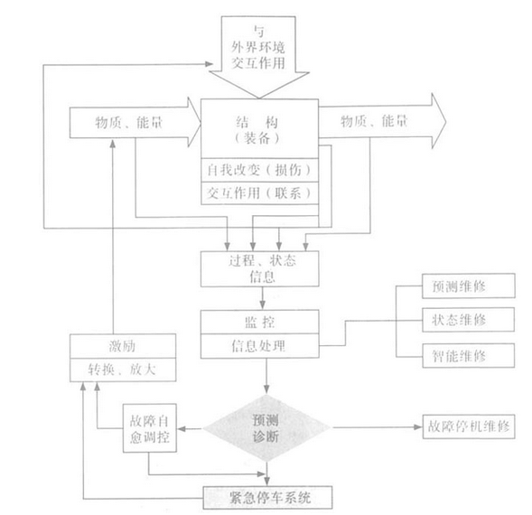
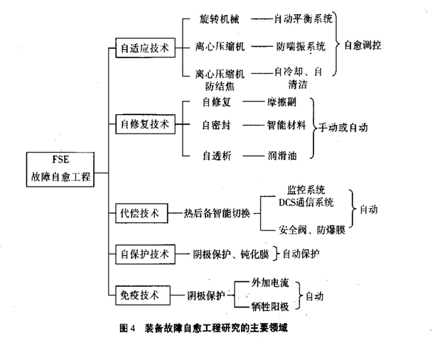
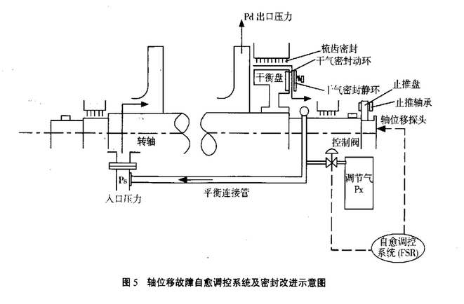

#装备系统故障自愈原理研究

##故障自愈机制建模研究

1. 研究系统刚度,阻尼和质量分布变化产生的机械整栋故障的条件和原因
2. 计算输入,输出系统能力的协调性及有害能量的转化,探测分析故障产生的条件和原因
3. 通过输出物质的量和特性的变化异常,研究故障产生的条件和原因

方法:

1. 消除故障产生的后果或启动反作用,抑制故障的发展
	* 消除刚刚产生的后果
	* 启动一个反作用因果链,抵消故障的因果链的作用
2. 消除故障的苗头,抑制故障的生产
	除了极少数突发故障外,绝大多数故障的产生是一个过程,渐进的.通过智能决策和主动控制消除这一初始原因,将故障消除在萌芽之中.
    
    
3. 消除产生故障的条件,抑制故障的苗头
	在装备运行中,通过对工况和状态的智能判别和调控或改变系统结构,避开或消除可能产生故障的条件,从而消除故障产生的土壤,抑制故障的发生.

在故障自愈建模研究过程中,要研究系统反应的快速性和正确性.所研究的系统是复杂系统,那么系统的信息量也非常大,如何根据大量信息提取出有用的信息,及时做出正确的反应,对对于系统自愈控制的顺利实施至关重要.可以考虑使用系统工程理论中的系统分析的方法,对系统信息进行筛选,分析,建立智能专家库,及时提供有用的控制方案供智能决策层选择.

## 装备系统故障自愈(FSR:fault self=recovery regulation)关键技术研究

在流程工业广泛应用的紧急停车系统(ESD)之前增设故障自愈调控系统(FSR),可确保安全的前提下大幅度减少自动连锁紧急停车,使其具备自愈功能,改变或减少靠人去治愈的传统维修方式

## 工程应用实例-透平机械轴位移故障自愈原理与增效技术

透平机械 : 具有叶片的动力式流体机械。透平机械的共同特点是装有叶片的转子作高速旋转运动，流体（气体或液体）流经叶片之间通道时，叶片与流体之间产生力的相互作用，借以实现能量转化。

**大型离心式旋转机械** : 运行中的轴向力是由流体对叶轮的分布压力产生的.一台多级叶轮组成的机组,各级叶轮两侧流体压力差的累积,在转子上作用的总轴向力将会很大,次轴向力在机组工况稳定下是一定值.轴位移超限将会给机组带来巨大的破坏作用,目前大型机组都配备了周围一超限报警和故障连锁停车功能.但是报警不能消除故障,即使停机检修也未必很快发现轴位移超标的真正原因.更重要的是,由于轴向力超限造成的故障同时具备突发性和强烈的破坏性,造成轴承损坏.

紧急停车连锁系统会中断生产;频繁启停车也会产生新的故障.

**轴位移故障原因**:机器部件及输入输出相互作用的结果,而且装备的效率会随着工况的变化而变化.

**方法**:依据系统科学理论,轴位移故常是透平机械复杂系统运行中相互作用的结果,实时检测机器的状态和工况,分析产生轴位移的故障的原因,通过决策和主动控制,消除产生故障的原因或通过调控产生一个反作用来抵消,减弱故障的作用,从而在运行中抑制轴位移故障的发生,这就是轴位移故障自愈调控原理.如图所示,改系统可以使转子轴向稳定,可以在平衡盘上采用干气密封并确保其不易损坏.

##研究方法总结

1. 确定机器故障种类
2. 找出故障发生的原因
3. 运用只能决策和主动控制,抑制或消除故障发生和发展

###研究中遇到的问题

1. 没有数据支持
2. 无法对亚健康状态的机器进行仿真

