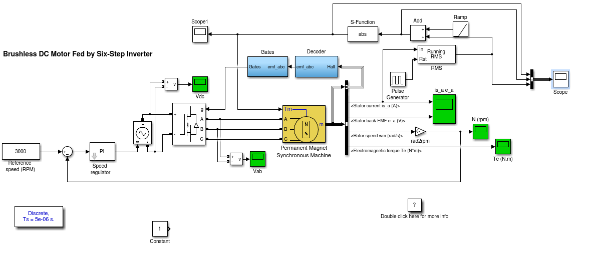
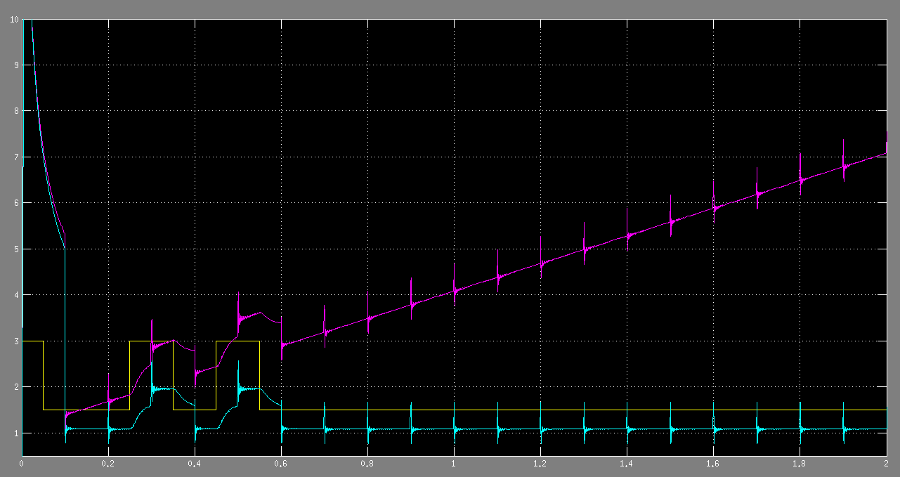

#基于 MATLAB 的异步电动机故障仿真分析





```matlab
function sys = mdlOutputs(t,x,u,tmp)

global tmp
if abs(mod(t - 0.15,0.1)) ==0
    if u < 3
        sys = 3;
        tmp = 3;
    else
        sys = 1.5;
        tmp = 1.5;
    end
else
    sys = tmp;
end
```