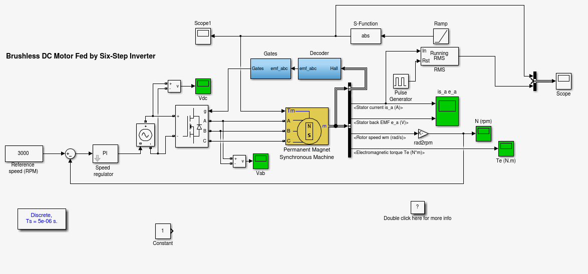

##自愈仿真




```matlab
function sys = mdlOutputs(t,x,u,tmp,T,time)

global tmp;
global T;
global time;
if t > time
    sys = tmp;
    time = time + T;
    T = T /  2;
    if tmp == 3
        tmp = 1.5;
    else
        tmp = 3;
    end
else
    sys = tmp;
end
```