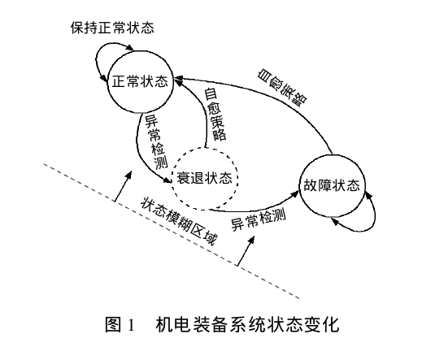
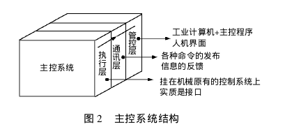
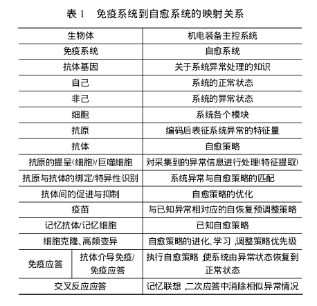
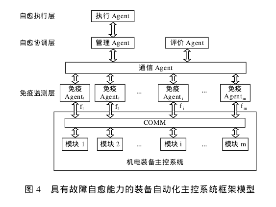

## 基于免疫 Agent 机电装备故障智能自愈系统建模

本文考虑将生物自愈机制赋予机电装备系统,使之具有自感知、自诊断、自恢复的能力;从结构和功能两方面入手使系统能够抵抗外来破坏和干扰,探讨一种具有普适性的装备故障自愈系统设计方法,以改变传统的靠紧急停车保护机器和信赖人工检修消除故障的传统方法。

机电装备系统自愈的实现依赖于系统状态的渐变性。可以考虑从 3 个方面使系统避免陷入故障状态:

1. 消除系统由衰退状态进入故障状态的条件
2. 创造从衰退状态转化到正常状态的条件
3. 创造从故障状态进入正常状态的条件

### 自愈定义

目前,自愈并没有形成统一的定义。本文结合机电装备系统的特点,特别是电气控制部分的系统软故障特征和规律,对机电装备故障自愈系统进行如下定义:

**自愈系统**:在系统运行过程中,能够自行感知系统运行环境和系统内部状态的变化;在期望的时间内,通过系统微单元之间信息的传递及协调,对系统局部的、早期的失效形式和故障实现自诊断,经优化决策后启动有效恢复机制的,具有免疫认知能力的系统。

为了满足上述定义,自愈系统应该具有

1. 能够实时监控系统的状态及行为;
2. 自主感知系统故障和异常;
3. 分析处理系统状态信息,实现故障诊断;
4. 自主更新系统知识库;
5. 制定优化的故障自愈策略;
6. 执行自愈策略,使系统恢复正常运行等特性。

机电装备系统是一个复杂的大系统,为了便于研究,本文主要针对装备的数字化主控系统 ( 不包括机械部分 ) ,采用软计算技术进行研究。主控系统,可以存在于任何含有两个以上控制器的系统中,但严格意义上讲,主控系统是将原来独立的多个分立子系统整合集成为一个能够协调运行的大系统,通过资源共享和信息互通,实现各子系统的联动和快速反应,提高对事件的反应能力和处理速度.

一个完整的生产自动化控制系统从硬件组成方面可大致分为:**管控层、通信层和执行层**.本文重点针对软故障,即那些缓慢变化的、通过适当的策略调控得到恢复故障,如输入输出接口设备中,串入的干扰和病毒导致的控制系统参数变化;电子电路中的偏置、漂移;主控计算机中存在的控制程序运行错误等。从故障原因角度看,造成机电装备主控系统软故障的主要原因有:人为操作不当引起的故障,外界干扰导致的故障及主控程序本身健壮性不足引起的故障.

### 免疫系统特征对机电装备自愈系统模型的启示

1. 识别“自己/非己”:通过定义自己/非己以及抗原/抗体,利用改进的阴性选择算法生成具有高覆盖率的非己检测器,识别系统的异常状态 ( 即非己状态 ) 。
2. 分布性和鲁棒性:系统的稳定性不受外界干扰或系统内部状态变化的影响,免疫系统的鲁棒性依赖于分布性.
3. 学习和免疫记忆:当免疫系统与某一种抗原发生反应,一部分转变为记忆细胞,当再次遭遇次抗原时,记忆细胞迅速消灭抗原,提高反应速度.
4. 抗体多样性及动态平衡:在免疫系统中,根据抗体与抗原的亲和力大小,系统动态地调整不同抗体的浓度.

### 免疫Agent

免疫Agent即把免疫机理与Agent技术相融合,将免疫机制引入Agent结构,构造的一种新型实体Agent.

1. 免疫监测层通过机电装备通讯单元获取系统状态和数据,对各个模块的运行状况进行监测和初步免疫决策;
2. 自愈协调层主要进行信息的处理和综合,在充分利用已有知识和各个免疫 Agent 提供信息的基础上对系统状态进行评估,处理免疫 Agent 的冲突消解与协商等问题,从全局角度给出系统最优免疫决策方案;
3. 自愈执行层根据系统评估结果,执行不同任务。

### 模型工作原理

首先,自愈系统对获取的主控系统状态参数进行特征提取和编码后送免疫识别单元,根据阴性选择和克隆选择原理,由训练和运行两个过程完成自己和非己识别。训练过程利用系统的正常状态,经过编码得到“自己”,按照改进的阴性选择算法 ( 融合了克隆选择过程 ) ,生成对“非己”空间有较高覆盖率的异常诊断器检测系统异常,即“非己”。在免疫 Agent 中,系统的“非已”状态被定义为“抗原”,免疫策略是“抗体”。根据免疫系统中抗体对抗原的记忆、防御和耐受以及抗体之间相互作用机制,实现自愈策略的优化匹配和学习记忆,模仿免疫系统中的一次和二次免疫应答,得到该异常的初步自愈策略;

管理 Agent,根据主控系统各模块的知识和评估单元分析得出的系统运行情况,通过综合分析对各个模块的初步自愈策略进行统筹安排;按照最优的自愈方案,有序地将执行信号发送给各个免疫 Agent 的执行单元。

### 评估Agent

接收来自各个免疫 Agent 的模块监测结果,并给出一个介于 (0,1) 之间的评估值 :

1. 当 0< <0.1 时,认为系统状态的正常偏差;
2. 当 0.1< <0.6,转入管理 Agent,生成最优自愈策略,并发送信号给各个免疫 Agent 的待执行单元,执行相应的模块修复
3. 当 0.6< <0.8 时,认为故障严重,采取抑制作用,迅速隔离/停止相关模块运行,系统低性能运行,争取时间故障导致停机之前得到排除,或采取细粒度技术处理个别模块
4. 当 >0.8 时,则迅速停机,防止发生事故。