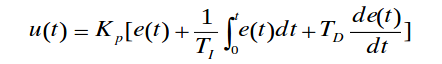

## 变频器

通常，把电压和频率固定不变的交流电变换为电压或频率可变的交流电的装置称作“变频器”。为了产生可变的电压和频率，该设备首先要把三相或单相交流电变换为直流电（DC）。然后再把直流电（DC）变换为三相或单相交流电（AC），我们把实现这种转换的装置称为“变频器”（inverter）。

#### 组成原理


1. 整流器。它与单相或三相交流电源相连接，产生脉动的直流电压。整流器有两种基本类型---可控和不可控的。
2. 中间电路。它有以下三种类型:
	* 将整流电压变换成直流电流。
	* 使脉动的直流电压变得稳定或平滑，供逆变器使用。
	* 将整流后固定的直流电压变换成可变的直流电压。
3. 逆变器。它产生电动机电压的频率。另外，一些逆变器还可以将固定的直流电压变换成可变的交流电压。
4. 控制电路。它将信号传送给整流器、中间电路和逆变器，同时它也接收来自这部分的信号。具体被控制的部分取决于各个变频器的设计。

#### 用途

* 电机控制的变频器，既可以改变电压，又可以改变频率。
* 计算机电源的供电，在该项应用中，变频器用于抑制反向电压、频率的波动及电源的瞬间断电。
* 空调,风机,水泵变频节能.

## 基于51单片机的直流电机PID设计

#### PID算法

####增量式PID

是指数字控制器的输出只是控制量的增量Δu(k)。采用增量式算法时，计算机输出的控制量Δu(k)对应的是本次执行机构位置的增量，而不是对应执行机构的实际位置，因此要求执行机构必须具有对控制量增量的累积功能，才能完成对被控对象的控制操作。执行机构的累积功能可以采用硬件的方法实现；也可以采用软件来实现，如利用算式 u(k)=u(k-1)+Δu(k)程序化来完成。增量式算法优点：①算式中不需要累加。控制增量Δu(k)的确定仅与最近3次的采样值有关，容易通过加权处理获得比较好的控制效果；②计算机每次只输出控制增量，即对应执行机构位置的变化量，故机器发生故障时影响范围小、不会严重影响生产过程；③手动—自动切换时冲击小。当控制从手动向自动切换时，可以作到无扰动切换。 

####位置式PID

该控制算法提供了执行机构的具体位置，PID输出与整个过去的状态有关，容易产生大的累加误差。位置式PID控制算法的缺点：当前采样时刻的输出与过去的各个状态有关，计算时要对e(k)进行累加，运算量大；而且控制器的输出u(k)对应的是执行机构的实际位置，如果计算机出现故障，u(k)的大幅度变化会引起执行机构位置的大幅度变化。

#### 直流电机调速方法

直流电动机的转速调节主要有三种方法：

1. 调节电枢供电的电压
	* 直流PWM调速:PWM调速系统的开关频率较高，仅靠电枢电感的滤波作用就可获得平稳的直流电流，低速特性好、稳速精度高、调速范围宽。同样，由于开关频率高,快速响应特性好,动态抗干扰能力强，可以获得很宽的频带；开关器件只工作在开关状态，因此主电路损耗小、装置效率高；直流电源采用不可控整流时，电网功率因数比相控整流器高。
	* 可控整流式调速系统
2. 减弱励磁磁通
3. 改变电枢回路电阻。

针对三种调速方法，都有各自的特点，也存在一定的缺陷。例如改变电枢回路电阻调速只能实现有级调速，减弱磁通虽然能够平滑调速，但这种方法的调速范围不大，一般都是配合变压调速使用。所以在直流调速系统中，都是以变压调速为主。

#### PWM脉冲宽度调制


U0 = a(占空比) * U

基本原理:通过PWM可以控制输出电压.

要改变等效直流电压的大小，可以通过改变脉冲幅值U和占空比a来实现，因为在实际系统设计中脉冲幅值一般是恒定的，所以通常通过控制占空比a的大小实现等效直流电压在0～U之间任意调节，从而达到利用 PWM控制技术实现对直流电机转速进行调节的目的。

#### 系统设计方案


按键和显示器用来实现人机交互功能，其中通过按键将需要设置的参数和状态输入到单片机中，并且通过控制器显示到显示器上。在运行过程中控制器产生PWM脉冲送到电机驱动电路中，经过放大后控制直流电机转速，同时利用速度检测模块将当前转速反馈到控制器中，控制器经过数字PID运算后改变PWM脉冲的占空比，实现电机转速实时控制的目的。 

#### 直流电机测速

1. 直流测速发电机测速可分为励磁式和永磁式两种,其输出的是电压值，如果使用在数字信号电路里是必须得用AD转换芯片转化成数字信号。而且其需要处于线性区，但是现实中线性的系统基本上很少，故而现在已经不常用。
2. 霍尔传感器测速是根据霍尔效应制作的一种磁场传感器。通过霍尔效应实验测定的霍尔系数，能够判断半导体材料的导电类型、载流子浓度及载流子迁移率等重要参数。电机每转一圈,每一相霍尔传感器产生2脉冲,且其周期与电机转速成反比,因此可以利用霍尔传感器信号得到电机的实际转速。为尽可能缩短一次速度采样的时间,可测得任意一相霍尔传感器的一个正脉冲的宽度,则电机的实际转速为V=N*(0;N:每秒采样的脉冲个数)
3. 光电编码器测速其效果跟霍尔测速一致，但是霍尔元件利用的是电磁产生脉冲，光电编码器利用的是光产生脉冲。它的原理是通过电动机的转动带动码盘的转动，码盘上有很多缝隙，缝隙每经过红外管一次就会产生一个脉冲，进而直接输入单片机，经过算法处理得到实际转速。

#### 硬件电路设计

1. STC89C52单片机
2. 电机驱动方案选择:选用L298N作为电机驱动单元，此驱动可控制两路电机，而且能满足正反转的要求
3. CH340：是一个USB总线的转接芯片，实现USB转串口、USB转IrDA红外或者USB转打印口.

## PID程序

原PID公式:



* u(t)——控制器(也称调节器)的输出；
* e(t)——控制器的输入（常常是设定值与被控量之差，即e(t)=r(t)-c(t)）
* Kp——控制器的比例放大系数；
* Ti ——控制器的积分时间；
* Td——控制器的微分时间。

设u(k)为第k次采样时刻控制器的输出值，可得离散的PID算式:

$$u(k) = K_p e(k) + K_i \sum_{i=1}^{k} e(j) + K_d [e(k) - e (k - 1)]$$

式中:

$K_i = \frac{K_p T}{T_i} $为积分系数

$K_d = \frac{K_p T_d}{T} $为微分系数


换算增量式:

$$\triangle u(k) = u(k) - u(k - 1) = K_p \triangle e(k) + K_ie(k) + K_d[\triangle e(k) - \triangle e(k - 1)]$$

式中 :

$\triangle e(k) = e(k) - e(k - 1)$

进一步可以改写成:

$$\triangle u(k) = Ae(k) - Be(k - 1) + Ce(k - 2)$$


式中:

$A = K_p (1 + \frac{T}{T_i} + \frac{T_d}{T})$

$B = K_p (1 + \frac{2T_d}{T})$

$C = K_p \frac{T_d}{T}$

一般计算机控制系统的采样周期T在选定后就不再改变，所以，一旦确定了Kp、Ti、Td，只要使用前后3次测量的偏差值即可求出控制增量。

```c
/*************************************************************************
      > File Name: pid.c
      > Author: limbo
      > Mail: 468137306@qq.com
      > Created Time: 2014年12月02日 星期二 09时15分02秒
      > Last changed: 2014年12月02日 星期二 13时36分56秒
 ************************************************************************/
#include<stdio.h>
#define KP   0.1        //PID调节的比例常数
#define TI   0.05     //PID调节的积分常数
#define TD   0.01     //PID调节的微分时间常数
#define T    0.02     //采样周期

#define KPP   KP * ( 1 + (T / TI) + (TD / T) )
#define KI    KP * ( 1 + (2 * TD / T ) )
#define KD    KP * TD / T
#define SETPOINT 100

typedef struct PID
{
    double SetPoint; //设定目标 Desired Value
    double Kp; //比例常数 Proportional Const
    double Ki; //积分常数 Integral Const
    double Kd; //微分常数 Derivative Const
    double LastError;
    double PrevError;
} PID;

static PID sPID;
static PID *sptr = &sPID;

/*================================================================================
Initialize PID Structure  PID参数初始化
===============================================================================*/
void IncPIDInit(void)
{
    sptr->Kp = KPP;
    sptr->Ki = KI;
    sptr->Kd = KD;
    sptr->LastError = 0;
    sptr->PrevError = 0;
    sptr->SetPoint = SETPOINT;
}

/*===============================================================================
增量式PID计算部分
=================================================================================*/
double IncPIDCalc(double NextPoint)
{
    double iIncpid,iError;

    iError = sptr->SetPoint - NextPoint;

    iIncpid = sptr->Kp * iError - sptr->Ki * sptr->LastError + sptr->Kd * sptr->PrevError;
    sptr->PrevError = sptr->LastError;
    sptr->LastError = iError;
    return(NextPoint + iIncpid);
}


int main()
{
    printf("start:\n");
    IncPIDInit();
    double  i, tmp = 0, j = 0,sum = 0;
    while (j < 200)
    {
        i = IncPIDCalc(tmp);
        printf("%f ", i);
        printf(" LastError%f PrevError%f \n", sptr->LastError, sptr->PrevError);
        if(sum < sptr->SetPoint + 1 && sum > sptr->SetPoint - 1)
            break;
        tmp = i;
        j++;
    }


}
```
output:


start:                                                                                                                                                                   
35.000000 37.750000 51.537500 59.299375 66.964594 72.809986 77.754441 81.754154 85.050589 87.745992 89.957305 91.768917 93.253957 94.470990 95.468489 96.286018 96.956060 97.505218 97.955303 98.324188 98.626522 98.874311 99.077397 99.243845 99.380263 99.492070 99.583706 99.658810 99.720364 99.770813 99.812161 99.846049 99.873823 99.896587 99.915244 99.930535 99.943067 99.953338 99.961757 99.968656 99.974311 99.978945 99.982744 99.985857 99.988409 99.990500 99.992214 99.993618 99.994770 99.995713 99.996487 99.997121 99.997640 99.998066 99.998415 99.998701 99.998935 99.999127 99.999285 99.999414 99.999520 99.999606 99.999677 99.999735 99.999783 99.999822 99.999854 99.999881 99.999902 99.999920 99.999934 99.999946 99.999956 99.999964 99.999970 99.999976 99.999980 99.999984 99.999987 99.999989 99.999991 99.999993 99.999994 99.999995 99.999996 99.999997 99.999997 99.999998 99.999998 99.999999 99.999999 99.999999 99.999999 99.999999 99.999999 100.000000 100.000000 100.000000 100.000000 100.000000  

