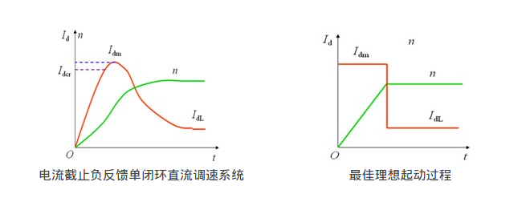
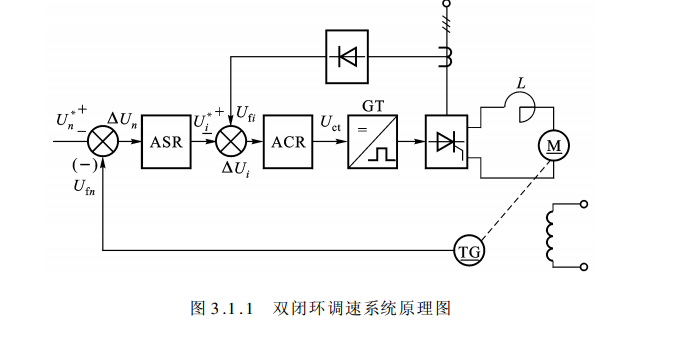
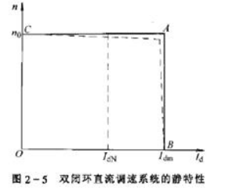
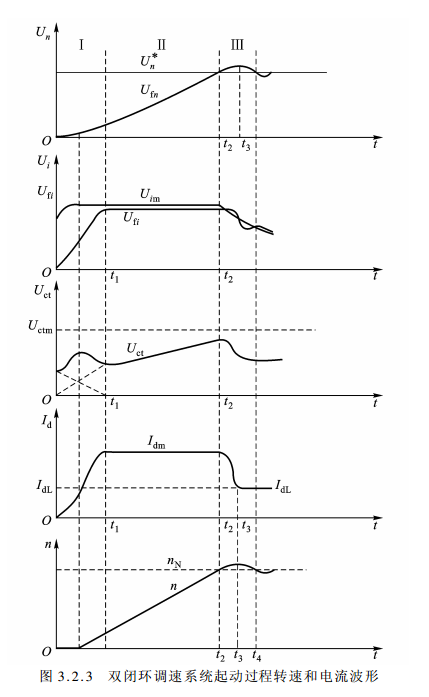
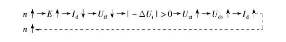
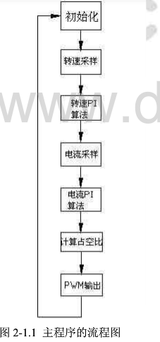

# 双闭环直流调速系统

## 稳态结构图

饱和:输出达到限幅值

不饱和:输出未达到限幅值

当调节器饱和时,输出为恒值,输入量的变化不再影响输出,除非有反向信号使调节器退出饱和,相当于开环.

实际上在运行的时候,ACR一般处于不饱和状态,因此,对于静态特性,只有ASR饱和和不饱和状态.

### 1 ASR不饱和

这时ASR和ACR不饱和,它们的电压偏差都为0:

$$U_n^* = U_n = \alpha n = \alpha n_0$$

$$U_i^* = U_i = \beta I_d$$

由第一个关系式可得:

$$n = U_n^* / \alpha  = n_0$$

从而得到如图所示CA段

与此同时,由于ASR不饱和,$U_i^* < U_{im}^*$, 从上述第二个关系式可知$I_d < I_{dm}$

其实这个$I_d$就是负载电流

$I_{dm}$取值应考虑电机允许过载能力和系统允许最大加速度,一般为额定电流的(1.5~2)倍.

### 2 ASR饱和

这时ASR输出达到限幅值$U_im^*$,转速外环呈开环状态,转速的变化对系统不再产生影响.双闭环系统编程一个电流无静差的单电流闭环调节系统.稳态时

$$I_d = U_{im}^* / \beta = I_{dm}$$

其中,最大电流$I_{dm}$是由设计者选定的,取决于电机的容许过载能力和拖动系统允许的最大加速度.上式所描述的静态特性对应于图中AB段,它是一条垂直的特性,这样的下垂特性只适合于$n < n_0$的情况,因为如果$n > n_0$,则$U_n > U_n^*$,ASR将退出饱和状态.

双闭环调速系统的特性在负载小于$I_{dm}$时表现为转速无静差
,这时转速负反馈起主要调节作用.当负载电流达到$I_{dm}$时,对应于转速调节器的饱和输出$U_{im}^*$,这时,电流调节器起主要调节作用,系统表现为电流无静差,得到过电流的自动保护.

## 双闭环系统启动过程分析

双闭环调速系统途加给定电压$U_n^*$后,其转速和电流在启动过程中的波形如图,其中1,2阶段速度调节器饱和,第3阶段速度调节器退出饱和发挥线性调节作用.

### 第一阶段(电流上升)

系统途加给定电压$U_n^*$后,由于电动机的机械惯性较大,转速和转速反馈量增长较慢,则速度调节器ASR的输入偏差电压的数值比较大,转速调节器的放大倍数较大,其输出很快达到饱和输出限幅值$U_{im}^*$.这个电压作为ACR的输入端,作为最大电流的给定值,使ACR的输出$U_et$首先靠比例部分的作用迅速增大,强迫电枢电$I_d$迅速上升.随着电流环反馈信号$U_{fi}$的上升,$\Delta U_i$逐渐减小,ACR的输出洗好$U_{et}$的比例部分随之减小,而积分部分逐渐累计增加.

在比例积分共同作用下,形成了如图所示$U_{et}$波形.

这一阶段的特点是转速调节器ASR因阶跃给定作用而迅速饱和,而电流调节器ACR一般为不饱和,以保证电流环的调节作用,强迫$I_d$上升,并达到$I_{dm}$.

### 第二阶段(恒流升速)

该阶段从电流上升到$I_{dm}$开始,直至转速上升到给定值对应的转速额定值为止,是启动的主要阶段.

在此期间,$U_{fn} < U_n^*$,ASR一直处于饱和状态,输出限幅$U_{fm}^*$不变,相当于转速环开环,系统表现为在恒值最大电流波形给定$U_{fm}^*$作用下的电流调节系统,基本上保持电流$I_{dm}$恒定.

在$t_1$时刻,当$I_d$升至$I_{dm}$时,ACR的比例积分维持$I_d = I_{dm}$值.在$U
_{im}$的恒值控制下,内环恒定$I_{dm}$的自动调节过程是:

$t_2$时刻n上升至给定转速.

### 第三阶段(转速趋于稳定)

$t_2$时刻,转速已达给定值,转速调节器的给定电压与反馈电压相平衡,输入偏差为0,但其输出由于PI的积分作用还维持在限幅值$U_{im}^*$,电动机仍在最大电流下继续加速,使转速产生超调,同时ASR的**输入端出现负偏差电压**,使转速调节器退出饱和状态,ASR输出电压也为ACR电流调节器的给定电压$U_i^*$从限幅值降下来,主电路电流$I_d$也随之迅速减小.但是,由于$I_d$仍大于负载电流$I_{dl}$,转速继续上升,直至$I_d = I_{dl}$.此后在负载力矩作用下,电机开始减速.当n达到给定值($t_4$)$I_d = I_{dL}$,系统进入稳态运行状态.

在这一阶段中,转速调节器ASR和电流调节器ACR都不饱和,共同担当调节作用.转速调节处于外环,起主导作用,促使转速迅速趋于给定值,并使系统稳定;电流调节器的作用则是力图使$I_d$尽快跟随转速调节器ASR的输出$U_i^*$的变化,也就是电流内环的调节过程是由速度外环支配,形成了一个电流随动系统.系统启动后进入稳态时,转速等于给定值,电流等于负载电流,ASR和ACR的输入偏差电压均为0.

## 两个调节器的作用

### ACR

1. 起电流调节作用
	* 启动时,在ASR的饱和作用下,通过ACR的调节,使电枢电流保持允许的最大值$I_{dm}$,加快过渡过程,实现快速起动.
	* 通过设置ASR的饱和限幅值,依靠ACR的调节作用,可限制最大电枢电流,$I_{dm} <=U_{im}^* / \beta$
2. 在电网波动时,通过ACR的调节,使电网电压的波动几乎不对转速产生影响
3. 在电机过载甚至堵转时,一方面限制过大的电流,起到快速保护作用;另一方面,使转速迅速下降,实现"挖土机"特性

### ASR

1. 起转速调节作用
	* 使转速n跟随给定电压$U_n^*$变化
	* 稳态运行时．稳定转速．使转速保持$n = U_n^* / \alpha$的数值上,无静差.
2. 在负载变化而使转速出现偏差时,靠ASR的调节作用来消除转速偏差,保持转速恒定.
3. ASR的输出限幅值决定了系统允许的最大电流,作用于ACR,以获得较快的动态响应.