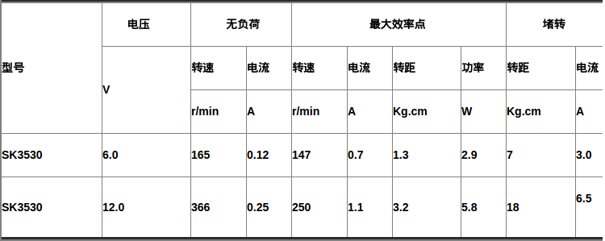

## 程序执行流程

1. 写好程序，用```$ arm-linux-gcc -o test main.c```编译主程序
1. 开启小车连入网线
2. 终端输入```$ telnet 222.26.7.129```连入小车
3. 打开filezilla用FTP把程序传入小车
4. 在终端里修改```test```文件权限，```$ chmod 777 test```
5. 运行程序```$./test```

## 程序

```cpp
int uart_init(char *dev, int rate,int databits,int stopbits,int parity);

uart_init("/dev/ttySAC2", 115200,8,1,'N');
```

说明：

设置端口返回设备描述符

参数：

* dev : 设备ttySAC0（1，2，3）
* rate: 波特率115200
* databits : 数据位数7,8
* stopbits : 1,2
* parity :　奇偶校验，N，n: 无校验，E,e: 偶校验，O，e:奇校验


```cpp
write(int fd, *buffer,length);

write(fd_uart2,"P1,0,30,2,0,30\n",16);
```

说明：

设备端口写入函数，成功返回写入数据的字节数,该值通常等于length，如果写入失败返回-1。

参数：

* fd：文件描述符
* *buffer：存储写入数据的数据缓冲区
* length：写入缓冲去的数据字节数


```cpp
car_parm(&speed_left,&speed_right,&current_left,&current_right);
```

说明：

读取转速和电流文件

参数：

*　speed_left: 左轮转速
*　speed_right: 右轮转速
*　current_left:　左轮电流
*　current_right:　右轮电流

main.c

```cpp
#include     <stdio.h>      /*标准输入输出定义*/
#include     <stdlib.h>     /*标准函数库定义*/
#include     <unistd.h>     /*Unix 标准函数定义*/
#include     <sys/types.h>
#include     <sys/stat.h>
#include     <fcntl.h>      /*文件控制定义*/
#include     <termios.h>    /*PPSIX 终端控制定义*/
#include     <errno.h>      /*错误号定义*/
#include     <time.h>

#include     <string.h>
#include     <linux/input.h>

#include     <sys/ioctl.h>
#include     <pthread.h>
#include     "uart.c"

void *thread_car_rev(void);
int car_parm(int *speed_left,int *speed_right,int *current_left,int *current_right);


int fd_uart2;
char uart2_buf[40];
char uart2_buf_bak[40];
int uart2_rec_data_rdy=0; //1=从串口收到数据，0=未从串口收到数据
int uart_rec_counter1=0;

int main(void)
{
    char buffer[90];
    int ret,i;
    pthread_t id;
    static int cnt;
    int speed_left,speed_right,current_left,current_right;

    printf("Hello World!\n");
    fd_uart2=uart_init("/dev/ttySAC2", 115200,8,1,'N');

    write(fd_uart2,"P1,0,30,2,0,30\n",16);

    ret=pthread_create(&id,NULL,(void *) thread_car_rev,NULL);

    while(cnt < 10)
    {
        write(fd_uart2,"P1,0,10,2,0,10\n",15);

        for(i=0;i<5;i++)
        {
            ret=car_parm(&speed_left,&speed_right,&current_left,&current_right);
            if(ret==0)
                //printf("no data\n");
                printf(" ");
            else
                printf("left speed=%d right speed=%d left current=%d right current=%d\n",speed_left,speed_right,current_left,current_right);
            sleep(1);
        }
        cnt++;
    }

    close(fd_uart2);

    return 0;

}

int car_parm(int *speed_left,int *speed_right,int *current_left,int *current_right)
{
    char *p1;
    char buf[10];

    if(uart2_rec_data_rdy==0)
        return 0;

    uart2_rec_data_rdy=0;

    p1=strtok(uart2_buf_bak,",");
    strcpy(buf,p1);

    *speed_left=atoi(&(buf[1]));

    p1 = strtok(NULL,",");
    *speed_right=atoi(p1);

    p1 = strtok(NULL,",");
    *current_left=atoi(p1);

    p1 = strtok(NULL,",");
    *current_right=atoi(p1);

}


void *thread_car_rev(void)
{
    char buffer[10];
    int size;
    static int uart_rec_counter1=0;
    static char uart2_buf[45];

    while(1)
    {
        size=read(fd_uart2,buffer,1);

        if(buffer[0]==0x0a) //0x0d 0x0a需要注意，调试助手和实际STC51板子不同
        {
            strcpy(uart2_buf_bak,uart2_buf);//no segmentation fault
            uart_rec_counter1=0;
            uart2_rec_data_rdy=1;
        }
        else
        {
            uart2_buf[uart_rec_counter1]=buffer[0];
            uart_rec_counter1++;
        }
    }
}
```

## 电机参数



